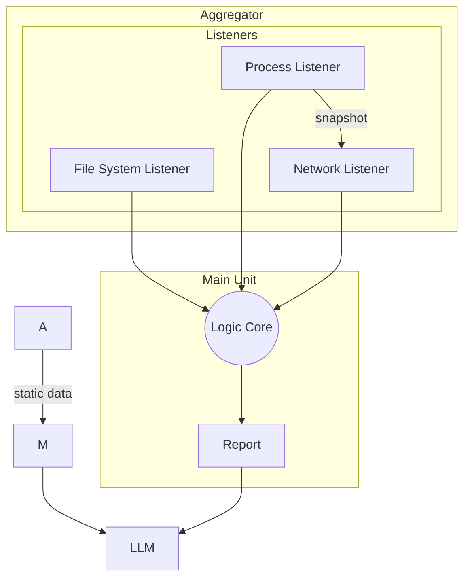

# Dev Notes

## Flow Chart

## To-Do
- [ ] Build Aggregator to align asynchronous processes.
- [x] Build NetworkListener
- [x] Build ProcessListener
- [x] Build FileSystemListener

# Dev Notes

1. The FileSystemListener uses the watchdog observer method to listen to file system events. The observer process runs asynchronously in a dedicated thread. All aggregated process information is stored in the ProcessListener cache. The cache changes with every event.

2. The NetworkListener tracks every E2E connection with corr. remote domain of all processes. Every remote domain will be looked up and stored in a dns file. The NetworkListener relies on the ProcessListener cache to derive the process connection information. 